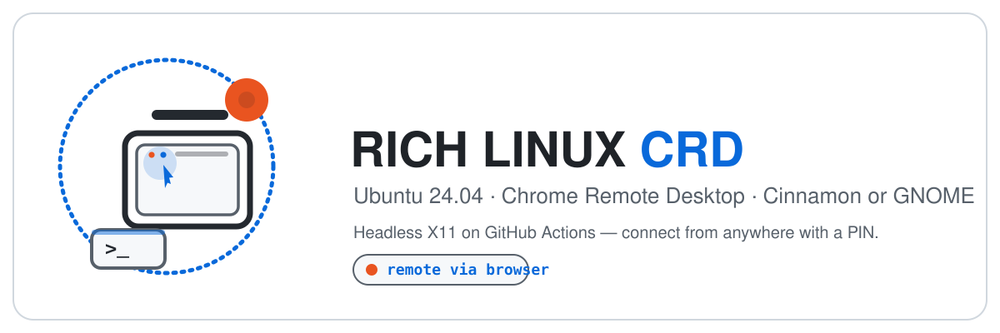
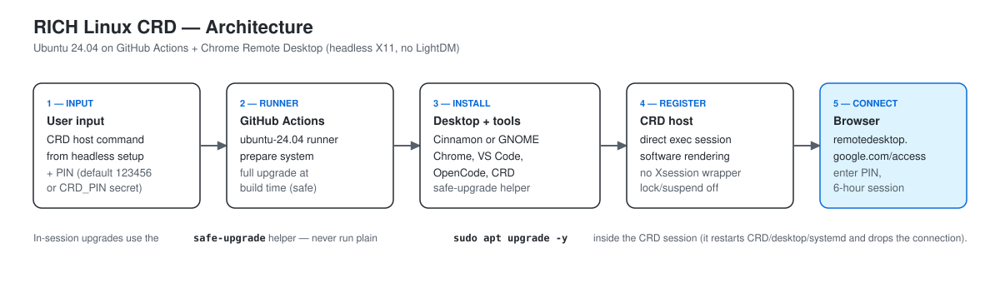

# RICH Linux CRD — Ringkasan Bahasa Indonesia

[English](README.md) | **Bahasa Indonesia**

> Ubuntu 24.04 di GitHub Actions + Chrome Remote Desktop. Pilih desktop **Cinnamon** yang ringan atau **GNOME** yang stabil, lalu remote dari mana saja dengan PIN.

<p align="center">
  
</p>

Dokumen utama (lengkap, dalam Bahasa Inggris): [README.md](README.md). Halaman ini ringkasannya dalam Bahasa Indonesia.

**Fitur cepat:**
- **Setup 4 langkah, 5 menit** — fork repo → salin perintah CRD → jalankan workflow → konek dari browser. Tanpa SSH, tanpa port forwarding, tanpa firewall.
- **Tema Catppuccin + Ikon Zafiro** — workflow Cinnamon otomatis memasang tema Catppuccin-B-LB-Dark dan ikon Zafiro-Nord-Black.
- **Resolusi otomatis 1600x1200** (Cinnamon + GNOME) — xrandr auto-detect tampilan dan menerapkan resolusi optimal, plus fallback autostart.
- **Virtualisasi KVM** — dukungan `/dev/kvm` (Intel VT-x) dimanfaatkan: QEMU/KVM + libvirt + virt-manager + GNOME Boxes siap pakai; user `runner` sudah masuk grup `kvm` dan `libvirt`.
- **Audio streaming** — Chrome Remote Desktop menyiarkan audio dari sesi remote ke browser secara otomatis.
- **Instalasi senyap** — hook needrestart dinonaktifkan, jadi tidak ada log `Scanning processes...` dan tidak ada restart layanan otomatis saat install/upgrade (mencegah sesi CRD putus).



---

## Fitur Unggulan

### Setup Mudah — 4 Langkah, 5 Menit

Tanpa SSH keys, tanpa port forwarding, tanpa firewall. Fork repo ini, salin perintah CRD dari halaman Google, tempel ke workflow GitHub Actions di fork Anda, dan konek dari browser. Seluruh stack — desktop environment, browser, code editor, dan remote access — terinstal otomatis.

### Pengalaman Remote yang Mulus

Sesi Cinnamon dan GNOME dikonfigurasi untuk operasi headless:

- **Direct exec** — session file melewati wrapper LightDM/Xsession yang menyebabkan crash "Oh no! Something has gone wrong"
- **Mesa software rendering** (`LIBGL_ALWAYS_SOFTWARE=1`) memastikan desktop render dengan benar di GitHub Actions runner tanpa GPU fisik
- **Screensaver dan lock dinonaktifkan** — sesi tetap hidup dan responsif, tidak pernah timeout atau mengunci Anda keluar
- **Resolusi otomatis 1600x1200** (Cinnamon + GNOME) — xrandr auto-detect tampilan dan menerapkan resolusi optimal, plus fallback autostart

### Audio Streaming

Chrome Remote Desktop menyiarkan audio dari sesi remote ke browser secara otomatis. Tidak perlu konfigurasi PulseAudio atau PipeWire — Cinnamon dan GNOME keduanya menggunakan audio stack Ubuntu default, dan CRD menangani sisanya. Putar musik, tonton video, atau ikut video call — audio langsung jalan.

### Tema Catppuccin & Ikon Zafiro (Cinnamon)

Workflow Cinnamon hadir dengan tampilan premium langsung dari awal:

- **Catppuccin-B-LB-Dark** — tema GTK/Cinnamon gelap dengan elemen UI yang halus dan rounded
- **Zafiro-Nord-Black** — tema ikon flat minimalis berdasarkan palet warna Nord
- **Wallpaper Catppuccin Black Unicat** — sudah di-set sebagai background desktop
- Tema dan ikon diterapkan otomatis via dconf, dengan autostart fallback agar persist lintas sesi

### Dev Tools Bawaan

| Tool | Kegunaan | Tersedia di |
|---|---|---|
| Google Chrome | Browser lengkap dengan ekstensi, profil, dan DevTools | Cinnamon + GNOME |
| VS Code | Code editor dengan terminal, ekstensi, dan remote development | **GNOME saja**; untuk Cinnamon pasang via `sudo apt-get install code` |
| OpenCode CLI + Desktop | Asisten coding bertenaga AI | Cinnamon + GNOME |
| Virtual Machine tools | QEMU/KVM, libvirt (`virsh`, `virt-install`), virt-manager, GNOME Boxes | Cinnamon + GNOME |

GNOME menyediakan shortcut desktop (Antigravity, VS Code, OpenCode, Safe Upgrade). Cinnamon menggunakan desktop bersih dengan tool di menu aplikasi.

### Virtualisasi KVM (Hardware-Accelerated VM)

Runner GitHub ini mengekspos `/dev/kvm` (Intel VT-x), jadi desktop bisa menjalankan **VM berakselerasi hardware** — bukan emulasi software yang lambat. Kedua workflow memasang stack QEMU/libvirt dan memberi akses langsung ke user `runner`:

- **QEMU/KVM** (`qemu-system-x86_64`, `/dev/kvm`) — virtualisasi CPU berakselerasi hardware
- **libvirt** (`libvirtd`, `virsh`, `virt-install`) — daemon manajemen VM, aktif saat build
- **Virtual Machine Manager** (`virt-manager`) — GUI lengkap untuk membuat/mengelola VM
- **GNOME Boxes** (`gnome-boxes`) — GUI sederhana untuk pemula

Kelebihan:

- Jalankan ISO apa pun (distro Linux lain, BSD, ISO Windows evaluasi) di dalam desktop remote dengan kecepatan CPU mendekati native
- Nested virtualization aktif — berguna untuk mengetes software yang butuh VT-x (VM di dalam VM bisa jalan)
- Tanpa setup — `runner` sudah masuk grup `kvm` + `libvirt`; tinggal buka **Virtual Machine Manager** atau **GNOME Boxes** → New VM → pilih ISO

Keterbatasan yang jujur:

- KVM **tidak** mempercepat rendering sesi CRD itu sendiri — desktop tetap memakai Mesa software rendering (tanpa GPU fisik). Jangan berharap UI desktop lebih cepat atau GPU acceleration dari fitur ini.
- Tidak ada GPU passthrough. VM sebaiknya memakai display software/virtio (mis. `virtio-gpu` / QXL); akselerasi 3D di dalam guest terbatas.
- Budget vCPU/RAM runner terbatas dan dipakai bersama sesi CRD yang sedang hidup — buat VM dengan ukuran wajar.
- `/dev/kvm` ada di runner tempat proyek ini dikembangkan, tetapi **tidak semua runner GitHub dijamin punya**. Kalau tidak ada, workflow hanya memberi peringatan (tidak gagal) dan VM akan jatuh ke emulasi QEMU TCG yang lambat.

### Upgrade Anti-Putus

Menjalankan `sudo apt upgrade` di dalam sesi CRD memutus koneksi (karena me-restart service CRD/GNOME/systemd). Helper [`safe-upgrade`](scripts/safe-upgrade.sh) menyelesaikan ini:

- Menahan paket kritis (CRD, desktop shell, systemd, kernel)
- Mengupgrade sisanya dengan aman
- MOTD warning di kedua workflow (plus shortcut **Safe Upgrade** di GNOME) mencegah `apt upgrade` yang tidak sengaja

`safe-upgrade` juga dilengkapi fitur keamanan ekstra:

- **Version diff** — menampilkan setiap paket yang di-upgrade sebagai `nama: versi_lama → versi_baru`, plus paket baru dan yang dihapus
- **`--cleanup`** — menjalankan `apt-get autoremove` setelah upgrade untuk menghemat ruang disk
- **Rollback tracking** — snapshot semua versi paket sebelum & sesudah ke `/var/log/safe-upgrade-pre.log` dan `/var/log/safe-upgrade-post.log`
- **Tabel ringkasan** — ringkasan berwarna untuk paket yang di-upgrade / di-hold / dihapus dan durasi
- **Cek reboot kernel** — memperingatkan bila kernel baru terinstall tetapi belum aktif
- **Anti-interupsi** — trap `SIGINT`/`SIGTERM`/`EXIT` otomatis melepas hold paket bila upgrade dibatalkan di tengah jalan

---

## Mulai Cepat (5 menit)

Workflow memakai `workflow_dispatch`, jadi **harus dijalankan dari fork milik Anda** — GitHub hanya mengizinkan trigger Actions di repo yang Anda kontrol.

### 0. Fork repository ini

1. Buka <https://github.com/kiraadityaa/rich-linux-crd>.
2. Klik **Fork** (kanan atas) untuk membuat salinan di akun GitHub Anda.
3. Semua langkah berikut dilakukan di **fork Anda**.

### 1. Ambil perintah host CRD

1. Buka <https://remotedesktop.google.com/headless> di browser yang login akun Google.
2. Klik **Begin** → **Next** → **Authorize**.
3. Salin **perintah Debian Linux** yang muncul (diawali `DISPLAY= ... start-host ...`). Jangan dijalankan di lokal — cukup salin.

### 2. Jalankan workflow

1. Buka tab **Actions** di **fork Anda**.
2. Pilih workflow:
   - **RICH LINUX (Cinnamon + Chrome Remote Desktop)** → file `.github/workflows/cinnamon.yml`
   - **RICH LINUX (GNOME + Chrome Remote Desktop)** → file `.github/workflows/gnome.yml`
3. Klik **Run workflow**, tempel perintah CRD ke field `crd_host_command`, klik **Run**.
4. Tunggu sekitar 5–10 menit sampai log menampilkan `CHROME REMOTE DESKTOP READY`.

### 3. Connect

1. Buka <https://remotedesktop.google.com/access>.
2. Klik perangkatmu → masukkan PIN:
   - Default: `123456`
   - Custom: buat secret repo bernama `CRD_PIN` (minimal 6 digit) sebelum menjalankan workflow.

---

## Cinnamon vs GNOME

|  | Cinnamon (`cinnamon.yml`) | GNOME (`gnome.yml`) |
|---|---|---|
| Tampilan | Klasik ala Linux Mint | Modern ala Ubuntu |
| Ukuran install | Sekitar 1 GB | Sekitar 2 GB |
| Tema | Catppuccin-B-LB-Dark + ikon Zafiro-Nord-Black (otomatis) | Adwaita default |
| Resolusi | Otomatis 1600x1200 via xrandr (retry + fallback autostart) | Otomatis 1600x1200 via xrandr (retry + fallback autostart) |
| Sesi CRD | `exec /usr/bin/cinnamon-session --session cinnamon` + `LIBGL_ALWAYS_SOFTWARE=1` | `exec /usr/bin/gnome-session --session=ubuntu` (auto-detect `ubuntu` > `gnome` > `gnome-xorg`) + `LIBGL_ALWAYS_SOFTWARE=1` |
| Display manager | Tidak dipakai (headless) | Tidak dipakai (headless) |
| Shortcut desktop | Tidak ada (desktop bersih) | Antigravity, VS Code, OpenCode, Safe Upgrade |
| Dev tools | Chrome + OpenCode CLI/Desktop | Chrome + VS Code + OpenCode CLI/Desktop |
| Virtualisasi | QEMU/KVM + libvirt + virt-manager + GNOME Boxes | QEMU/KVM + libvirt + virt-manager + GNOME Boxes |
| Screensaver, lock, suspend | Dinonaktifkan | Dinonaktifkan |
| Wallpaper | Catppuccin Black Unicat (via `org.cinnamon.desktop.background`) | Catppuccin Black Unicat (via `org.gnome.desktop.background`) |
| Upgrade | `safe-upgrade` di sesi (tanpa build-time full upgrade — bisa ditambah via kustomisasi) | Full upgrade di build-time + `safe-upgrade` di sesi |
| Cocok untuk | Tampilan ala Mint, ukuran lebih ringan, tema premium | Stabilitas maksimal |

---

## Troubleshooting: Error "Oh no! Something has gone wrong"

Gejala: PIN benar dan koneksi berhasil, tapi layar menampilkan wajah sedih dengan tombol **Log Out**.

Penyebab: session file lama memakai wrapper `lightdm-session` yang membutuhkan LightDM seat fisik — tidak ada di runner CRD yang headless.

Solusi sudah diterapkan di kedua workflow (direct exec tanpa wrapper, plus paket Mesa/LLVMPipe untuk software rendering):

```bash
# Cinnamon
DESKTOP_SESSION=cinnamon
XDG_CURRENT_DESKTOP=X-Cinnamon
XDG_SESSION_TYPE=x11
XDG_RUNTIME_DIR=/run/user/$(id -u)
LIBGL_ALWAYS_SOFTWARE=1
exec /usr/bin/cinnamon-session --session cinnamon

# GNOME (auto-detect ubuntu > gnome > gnome-xorg)
DESKTOP_SESSION=ubuntu
XDG_CURRENT_DESKTOP=ubuntu:GNOME
XDG_SESSION_TYPE=x11
XDG_RUNTIME_DIR=/run/user/$(id -u)
LIBGL_ALWAYS_SOFTWARE=1
MUTTER_DEBUG_FORCE_SOFTWARE_RENDER=1
exec /usr/bin/gnome-session --session=ubuntu
```

---

## Penting: jangan `apt upgrade` polos di dalam sesi

Gejala: setelah `sudo apt update && sudo apt upgrade -y`, sesi tiba-tiba putus dan tidak bisa konek ulang.

Penyebab: upgrade ikut menaikkan `chrome-remote-desktop` / `gnome-shell` / `mutter` / `gdm3` / `systemd` / `dbus`, lalu service-nya di-restart sehingga sesi X mati.

> [!WARNING]
> Jangan jalankan `sudo apt upgrade -y` polos di dalam sesi CRD. Pakai helper `safe-upgrade`.

| Kebutuhan | Cara |
|---|---|
| Upgrade harian yang aman (di terminal CRD) | `safe-upgrade` |
| Cek dulu tanpa mengubah apa pun | `safe-upgrade --check` |
| Upgrade + autoremove (hemat disk) | `safe-upgrade --cleanup` |
| Upgrade CRD/Chrome/desktop juga (SESI AKAN PUTUS) | `safe-upgrade --allow-crd-restart` / `safe-upgrade --include-desktop` |
| Dapat upgrade kritis tanpa putus | Re-run workflow Actions (workflow GNOME menjalankan full `upgrade` di build-time) |
| Lihat paket yang berubah | Baca version diff di output `safe-upgrade`, atau diff `/var/log/safe-upgrade-pre.log` vs `/var/log/safe-upgrade-post.log` |

Implementasi: [`scripts/safe-upgrade.sh`](scripts/safe-upgrade.sh). Dilengkapi **tabel ringkasan** berwarna, **version diff** (lama → baru), **rollback log** (`/var/log/safe-upgrade-pre.log` & `post.log`), **cek reboot kernel**, dan **trap anti-interupsi** yang otomatis melepas hold paket. Workflow GNOME juga memasang shortcut desktop **Safe Upgrade**; kedua workflow memasang MOTD warning.

---

## Struktur repo

```
rich-linux-crd/
├── .github/workflows/       # cinnamon.yml, gnome.yml
├── assets/
│   ├── architecture.svg     # Diagram arsitektur di README
│   ├── cinnamon-theme.zip   # Tema Catppuccin + ikon Zafiro (otomatis diinstal oleh workflow Cinnamon)
│   ├── rich-linux-crd-banner.svg
│   └── rich-linux-crd-logo.svg
├── opencode-setup/          # opencode-skills.md (panduan skill agent OpenCode + Context7)
├── scripts/                 # safe-upgrade.sh (version diff, --cleanup, rollback log, summary, reboot check)
├── README.md                # Dokumen utama (Inggris)
├── README.id.md             # File ini (Indonesia)
├── AGENTS.md                # Panduan melanjutkan proyek untuk agent/dev (Bahasa Indonesia)
├── LICENSE
└── .gitignore
```

---

## Kustomisasi

| Kebutuhan | Cara |
|---|---|
| Ganti PIN | Buat secret repo `CRD_PIN` (Settings → Secrets → Actions), minimal 6 digit |
| Ganti password user `runner` | Edit baris `echo "runner:...` di workflow. Default password "root" di kedua workflow |
| Tambah aplikasi | Tambah step `apt-get install` baru sebelum step CRD, mis. `apt-get install -y code` untuk menambah VS Code di Cinnamon (needrestart sudah dinonaktifkan, jadi tetap senyap) |
| Ganti wallpaper | Edit URL download di step **Set Wallpaper** di workflow |
| Ganti resolusi tampilan | Edit config dummy Xorg dan perintah xrandr di step **Configure CRD Cinnamon Session** (STEP 08) di `cinnamon.yml` |
| Kelola virtual machine | Buka **Virtual Machine Manager** atau **GNOME Boxes** dari menu aplikasi → New VM → pilih ISO (`runner` sudah punya akses `/dev/kvm`) |
| Ganti tema | Ganti `cinnamon-theme.zip` di `assets/` dengan tema Anda sendiri (harus berisi direktori `themes/` dan `icons/`) |
| Perpanjang durasi | Edit `sleep 21600` di step **Keep Alive** (maks 6 jam karena limit Actions) |

---

## Catatan

- Workflow menggunakan `workflow_dispatch` — hanya berjalan saat Anda menjalankan secara manual.
- GitHub hanya mengizinkan Actions di repo yang Anda kontrol — **fork repository ini dulu**, lalu jalankan workflow dari fork Anda.
- Jangan commit perintah CRD ke repo (berisi kode auth sekali pakai). Cukup tempel ke input workflow.
- PIN default `123456` hanya untuk kemudahan. Untuk penggunaan serius, buat `CRD_PIN` custom.
- GitHub Actions free tier punya batas menit bulanan — pantau Settings → Billing.
- Workflow Cinnamon secara otomatis memasang tema Catppuccin dan ikon Zafiro dari `assets/cinnamon-theme.zip` — tidak perlu setup manual.
- Resolusi tampilan di-set ke 1600x1200 via xrandr auto-detection di session file (baik Cinnamon maupun GNOME).
- KVM tersedia di runner GitHub ini (`/dev/kvm`, Intel VT-x, nested = aktif) — dipakai untuk **VM berakselerasi hardware** di dalam desktop. Fitur ini tidak mempercepat rendering CRD itu sendiri, dan ketersediaannya bisa berbeda antar fleet runner GitHub: kalau `/dev/kvm` tidak ada, workflow hanya memperingatkan (tidak gagal) dan VM akan jatuh ke QEMU TCG (lambat).
- `safe-upgrade` menyimpan snapshot versi paket sebelum/sesudah di `/var/log/safe-upgrade-pre.log` dan `/var/log/safe-upgrade-post.log` — diff keduanya untuk melihat perubahan persis.

---

## Lisensi

MIT — lihat [LICENSE](LICENSE).
