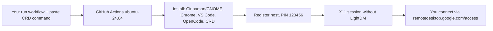

# RICH Linux CRD

**English** | [Bahasa Indonesia](README.id.md)

> Ubuntu 24.04 on GitHub Actions + Chrome Remote Desktop. Pick your desktop — lightweight **Cinnamon** or stable **GNOME** — and connect from anywhere with a PIN.

<p align="center">
  <a href="https://github.com/kiraadityaa/rich-linux-crd/actions/workflows/cinnamon.yml"></a>
  <a href="https://github.com/kiraadityaa/rich-linux-crd/actions/workflows/gnome.yml"></a>
  
  
  
  
  
  
  
</p>


Image sources: workflow status badges from GitHub Actions, technology badges from Shields.io, architecture diagram from [`assets/architecture.svg`](assets/architecture.svg) in this repository. No external stock photography.

---

## Overview

| Feature | Detail |
|---|---|
| Two desktops | Cinnamon Full (approx. 1 GB) or GNOME Ubuntu Desktop (approx. 2 GB) |
| Instant remote access | Chrome Remote Desktop, default PIN `123456` (customizable via secret) |
| Dev tools included | Google Chrome, VS Code, OpenCode CLI + OpenCode Desktop |
| Session length | Automatic keep-alive per workflow run (up to 6 hours) |
| Crash-resistant session | Direct `exec` without `Xsession`/`lightdm` wrappers + Mesa software rendering (fixes the "Oh no! Something has gone wrong" screen) |
| Disconnect-safe upgrades | Full `upgrade` at build time + [`safe-upgrade`](scripts/safe-upgrade.sh) helper inside the session (holds CRD/desktop/systemd packages) |
| Quiet installs | Needrestart apt hook disabled (`/etc/apt/apt.conf.d/20needrestart` removed) → no "Scanning processes..." output and no auto service restarts during any install/upgrade |
| Wallpaper included | Catppuccin **Black Unicat** preinstalled for the `runner` user on both desktops |
| Desktop shortcuts | Antigravity, VS Code, Files, Terminal, OpenCode, Safe Upgrade |

---

## How it works



---

## Quick Start (5 minutes)

### 1. Get the CRD host command

1. Open <https://remotedesktop.google.com/headless> in a browser logged in to your Google account.
2. Click **Begin** → **Next** → **Authorize**.
3. Copy the **Debian Linux** command shown (starts with `DISPLAY= ... start-host ...`). Do not run it locally — just copy it.

### 2. Run the workflow

1. Open the **Actions** tab in this repository.
2. Select a workflow:
   - **RICH LINUX (Cinnamon + Chrome Remote Desktop)** → file `.github/workflows/cinnamon.yml`
   - **RICH LINUX (GNOME + Chrome Remote Desktop)** → file `.github/workflows/gnome.yml`
3. Click **Run workflow**, paste the CRD command into the `crd_host_command` field, click **Run**.
4. Wait approx. 5–10 minutes until the log shows `CHROME REMOTE DESKTOP READY`.

### 3. Connect

1. Open <https://remotedesktop.google.com/access>.
2. Click your device → enter the PIN:
   - Default: `123456`
   - Custom: create a repository secret named `CRD_PIN` (minimum 6 digits) before running the workflow.
3. You are in the desktop.

---

## Cinnamon vs GNOME

|  | Cinnamon (`cinnamon.yml`) | GNOME (`gnome.yml`) |
|---|---|---|
| Look and feel | Classic, Linux Mint style | Modern Ubuntu style |
| Install size | Approx. 1 GB | Approx. 2 GB |
| CRD session | `exec /usr/bin/cinnamon-session --session cinnamon` + `LIBGL_ALWAYS_SOFTWARE=1` | `exec /usr/bin/gnome-session --session=ubuntu` + `LIBGL_ALWAYS_SOFTWARE=1` |
| Display manager | Not used (headless) | Not used (headless) |
| Screensaver, lock, suspend | Disabled (autostart + dconf no-lock, packages kept installed) | Disabled (dconf + gsettings no-lock, suspend set to `nothing`) |
| Wallpaper | Catppuccin Black Unicat (via `org.cinnamon.desktop.background`) | Catppuccin Black Unicat (via `org.gnome.desktop.background`) |
| Upgrades | Build-time full upgrade + `safe-upgrade` in session | Build-time full upgrade + `safe-upgrade` in session |
| Best for | Mint-style look, lighter footprint | Maximum stability |

---

## Troubleshooting

### Error: "Oh no! Something has gone wrong"

Symptom: the PIN is correct and the connection succeeds, but the screen shows a sad face with a **Log Out** button.

Cause: the session file used a `lightdm-session` wrapper that requires a physical LightDM seat — which does not exist on the headless CRD runner.

Fix already applied in both workflows:

```bash
# Cinnamon
DESKTOP_SESSION=cinnamon
XDG_CURRENT_DESKTOP=X-Cinnamon
XDG_SESSION_TYPE=x11
XDG_RUNTIME_DIR=/run/user/$(id -u)
LIBGL_ALWAYS_SOFTWARE=1
exec /usr/bin/cinnamon-session --session cinnamon

# GNOME (auto-detects ubuntu > gnome > gnome-xorg)
DESKTOP_SESSION=ubuntu
XDG_CURRENT_DESKTOP=ubuntu:GNOME
XDG_SESSION_TYPE=x11
XDG_RUNTIME_DIR=/run/user/$(id -u)
LIBGL_ALWAYS_SOFTWARE=1
MUTTER_DEBUG_FORCE_SOFTWARE_RENDER=1
exec /usr/bin/gnome-session --session=ubuntu
```

Plus Mesa/LLVMPipe packages for software rendering, with no conflicting LightDM installation.

### Session drops after `apt upgrade` and cannot reconnect

Symptom: after `sudo apt update && sudo apt upgrade -y`, the session drops suddenly and reconnecting fails. The log shows systemd restarting something.

Cause: the upgrade also raises `chrome-remote-desktop` / `gnome-shell` / `mutter` / `gdm3` / `systemd` / `dbus`, then restarts their services — killing the running X session mid-upgrade.

> [!WARNING]
> Never run plain `sudo apt upgrade -y` inside the CRD session. It restarts the display stack and drops the connection (recovery requires re-running the workflow).

| Need | Command |
|---|---|
| Safe daily upgrade (in the CRD terminal) | `safe-upgrade` (automatically holds critical packages, upgrades the rest) |
| Preview without changing anything | `safe-upgrade --check` |
| Upgrade CRD/Chrome/desktop too (WILL DISCONNECT) | `safe-upgrade --allow-crd-restart` / `safe-upgrade --include-desktop` |
| Get critical upgrades without disconnecting | Re-run the Actions workflow (it already runs a full `upgrade` at build time, before CRD starts) |

> [!TIP]
> Implementation: [`scripts/safe-upgrade.sh`](scripts/safe-upgrade.sh). The workflow also installs a **Safe Upgrade** desktop shortcut and a MOTD warning.

---

## Repository structure

```
rich-linux-crd/
├── .github/
│   └── workflows/
│       ├── cinnamon.yml   # RICH LINUX (Cinnamon + CRD)
│       └── gnome.yml      # RICH LINUX (GNOME + CRD)
├── assets/
│   └── architecture.svg # Architecture diagram used in this README
├── scripts/
│   └── safe-upgrade.sh  # Safe in-session upgrade (replacement for apt upgrade)
├── README.md            # This file (English)
├── README.id.md         # Indonesian summary
├── LICENSE
└── .gitignore
```

---

## Customization

| Need | How |
|---|---|
| Change PIN | Create a `CRD_PIN` repository secret (Settings → Secrets → Actions), 6+ digits |
| Change the `runner` user password | Edit the `echo "runner:...` line in the workflow |
| Add applications | Add a new `apt-get install` step before the CRD step (needrestart is already disabled, so it stays quiet) |
| Change the wallpaper | Edit the download URL in the **Set Wallpaper** step of the workflow |
| Extend duration | Edit `sleep 21600` in the **Keep Alive** step (max 6 hours due to the Actions limit) |

---

## Notes

- Workflows use `workflow_dispatch` — they only run when you trigger them manually.
- Never commit your CRD command to the repository (it contains a one-time auth code). Paste it only into the workflow input.
- The default PIN `123456` is for convenience only. For serious use, set a custom `CRD_PIN`.
- The GitHub Actions free tier has monthly minute limits — monitor Settings → Billing.

---

## Contributing

Pull requests and issues are welcome. If you find a new session error, please include:

1. Workflow name (Cinnamon / GNOME),
2. The **Verify Installation** step log excerpt,
3. The runner's `~/.chrome-remote-desktop-*.log` contents.

---

## License

MIT — see [LICENSE](LICENSE).
