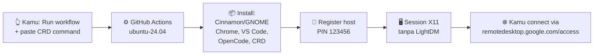

# 🖥️ RICH Linux CRD

> Ubuntu 24.04 di GitHub Actions + Chrome Remote Desktop. Pilih desktop favoritmu — **Cinnamon** yang elegan atau **GNOME** yang stabil — lalu remote dari mana saja pakai PIN.


<p align="center">
  <a href="https://github.com/kiraadityaa/rich-linux-crd/actions/workflows/cinnamon.yml"></a>
  <a href="https://github.com/kiraadityaa/rich-linux-crd/actions/workflows/gnome.yml"></a>
  
  
  
  
  
  
  
</p>

---

## ✨ Kenapa repo ini?

| Fitur | Detail |
|---|---|
| 🖥️ **2 pilihan desktop** | Cinnamon Full (~1 GB) atau GNOME Ubuntu Desktop (~2 GB) |
| 🌐 **Remote instan** | Chrome Remote Desktop, PIN default `123456` (bisa custom via secret) |
| 🧰 **Dev tools siap pakai** | Google Chrome, VS Code, OpenCode CLI + OpenCode Desktop |
| ⏳ **Tahan 6 jam** | Keep-alive otomatis per workflow run |
| 🛡️ **Anti crash Cinnamon** | Session tanpa `lightdm-session` + software rendering Mesa (fix layar *"Oh no! Something has gone wrong"*) |
| 📌 **Shortcut desktop** | Antigravity, VS Code, Files, Terminal, OpenCode |


---

## 🏗️ Cara kerja



---

## 🚀 Quick Start (5 menit)

### 1️⃣ Ambil CRD host command
1. Buka <https://remotedesktop.google.com/headless> di browser yang login akun Googlemu.
2. Klik **Begin** → **Next** → **Authorize**.
3. Salin **perintah Debian Linux** yang muncul (diawali `DISPLAY= ... start-host ...`). **Jangan jalankan di lokal** — cukup salin.

### 2️⃣ Jalankan workflow
1. Buka tab **Actions** di repo ini.
2. Pilih workflow:
   - 🟢 **RICH LINUX (Cinnamon + Chrome Remote Desktop)** → file `.github/workflows/cinnamon.yml`
   - 🔵 **RICH LINUX (GNOME + Chrome Remote Desktop)** → file `.github/workflows/gnome.yml`
3. Klik **Run workflow**, paste perintah CRD ke field `crd_host_command`, klik **Run**.
4. Tunggu ± 5–10 menit sampai log menampilkan `CHROME REMOTE DESKTOP READY`.

### 3️⃣ Connect
1. Buka <https://remotedesktop.google.com/access>.
2. Klik device-mu → masukkan PIN:
   - Default: `123456`
   - Custom: buat secret repo bernama `CRD_PIN` (minimal 6 digit) sebelum run workflow.
3. Langsung masuk desktop. 🎉


---

## 🆚 Cinnamon vs GNOME

|  | 🟢 Cinnamon (`cinnamon.yml`) | 🔵 GNOME (`gnome.yml`) |
|---|---|---|
| Tampilan | Klasik elegan ala Linux Mint | Modern ala Ubuntu |
| Ukuran install | ± 1 GB | ± 2 GB |
| Session CRD | `exec /etc/X11/Xsession cinnamon-session-cinnamon` + `LIBGL_ALWAYS_SOFTWARE=1` | `exec /etc/X11/Xsession "gnome-session"` |
| Display manager | ❌ Tidak dipakai (headless) | ❌ Tidak dipakai (headless) |
| Screensaver | Dihapus (`cinnamon-screensaver`) + dconf no-lock | Default GNOME |
| Cocok untuk | Pecinta tampilan Mint, lebih ringan | Kestabilan maksimal |

---

## 🧠 Fix penting: error *"Oh no! Something has gone wrong"*

Gejala: PIN benar dan connect berhasil, tapi layar menampilkan wajah sedih + tombol **Log Out**.

**Penyebab:** session file memakai `lightdm-session` wrapper yang butuh seat LightDM fisik — tidak ada di runner headless CRD.

**Solusi yang sudah diterapkan di `cinnamon.yml`:**

```bash
DESKTOP_SESSION=cinnamon
XDG_CURRENT_DESKTOP=X-Cinnamon
XDG_SESSION_TYPE=x11
XDG_RUNTIME_DIR=/run/user/$(id -u)
LIBGL_ALWAYS_SOFTWARE=1
exec /etc/X11/Xsession cinnamon-session-cinnamon
```

Plus: paket Mesa/LLVMPipe untuk software rendering + hapus instalasi LightDM yang konflik.

---

## 📁 Struktur repo

```
rich-linux-crd/
├── .github/
│   └── workflows/
│       ├── cinnamon.yml   # 🟢 RICH LINUX (Cinnamon + CRD)
│       └── gnome.yml      # 🔵 RICH LINUX (GNOME + CRD)
├── README.md
├── LICENSE
└── .gitignore
```

---

## 🔧 Kustomisasi

| Kebutuhan | Cara |
|---|---|
| Ganti PIN | Buat secret repo `CRD_PIN` (Settings → Secrets → Actions), isi 6+ digit |
| Ganti password user `runner` | Edit baris `echo "runner:...` di workflow |
| Tambah aplikasi | Tambah step `apt-get install` baru sebelum step CRD |
| Perpanjang durasi | Edit `sleep 21600` di step **Keep Alive** (maks. 6 jam karena limit Actions) |

---

## ⚠️ Catatan

- Workflow memakai `workflow_dispatch` — hanya jalan saat kamu trigger manual.
- Jangan commit perintah CRD-mu ke repo (berisi kode auth sekali pakai). Paste hanya di input workflow.
- PIN default `123456` hanya untuk kemudahan. Untuk pemakaian serius, gunakan `CRD_PIN` custom.
- GitHub Actions free tier punya batas menit bulanan — pantau di Settings → Billing.

---

## 🤝 Kontribusi

Pull request dan issue sangat diterima! Kalau menemukan error session baru, sertakan:
1. Nama workflow (Cinnamon / GNOME),
2. Potongan log step **Verify Installation**,
3. Isi `~/.chrome-remote-desktop-*.log` dari runner.

---

## 📷 Atribusi gambar

Foto hero dan ilustrasi oleh kontributor [Unsplash](https://unsplash.com) — bebas digunakan di bawah [Unsplash License](https://unsplash.com/license). Badge oleh [Shields.io](https://shields.io).

## 📄 Lisensi

MIT — lihat file [LICENSE](LICENSE).
